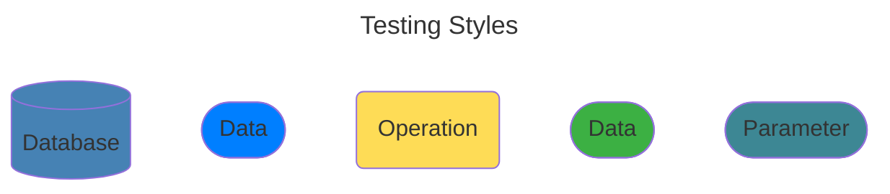
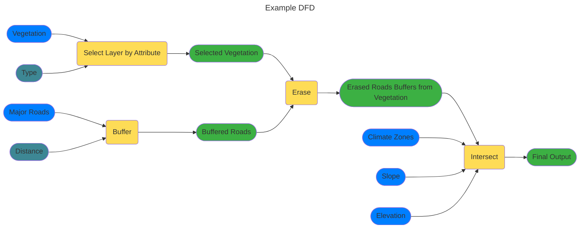

# Mermaid

```mermaid
---
title: Testing Styles
---
flowchart TD
    db1[(Database)]:::db
    in1([Data]):::input
    op1(Operation):::op
    out1([Data]):::output
    param1([Parameter]):::param

    classDef db fill:#4682b4
    classDef input fill:#007fff
    classDef op fill:#fedc56
    classDef output fill:#3cb043
    classDef param fill:#3d8794
```

```mermaid
---
title: Example DFD
---
flowchart LR
    %%This is a comment - the nodes are as follows
    in1([Vegetation]):::input
    in2([Major Roads]):::input
    param1([Type]):::param
    param2([Distance]):::param
    op1(Select Layer by Attribute):::op
    op2(Buffer):::op
    out1([Selected Vegetation]):::output
    out2([Buffered Roads]):::output
    op3(Erase):::op
    in3([Climate Zones]):::input
    in4([Slope]):::input
    in5([Elevation]):::input
    out3([Erased Roads Buffers from Vegetation]):::output
    op4(Intersect):::op
    out4([Final Output]):::output

    %%Constructing the graph from nodes
    in1 & param1 --> op1 --> out1
    in2 & param2 --> op2 --> out2
    out1 & out2 --> op3 --> out3
    out3 & in3 & in4 & in5 --> op4 --> out4

    %%Style classes for nodes
    classDef db fill:#4682b4
    classDef input fill:#007fff
    classDef op fill:#fedc56
    classDef output fill:#3cb043
    classDef param fill:#3d8794
```
